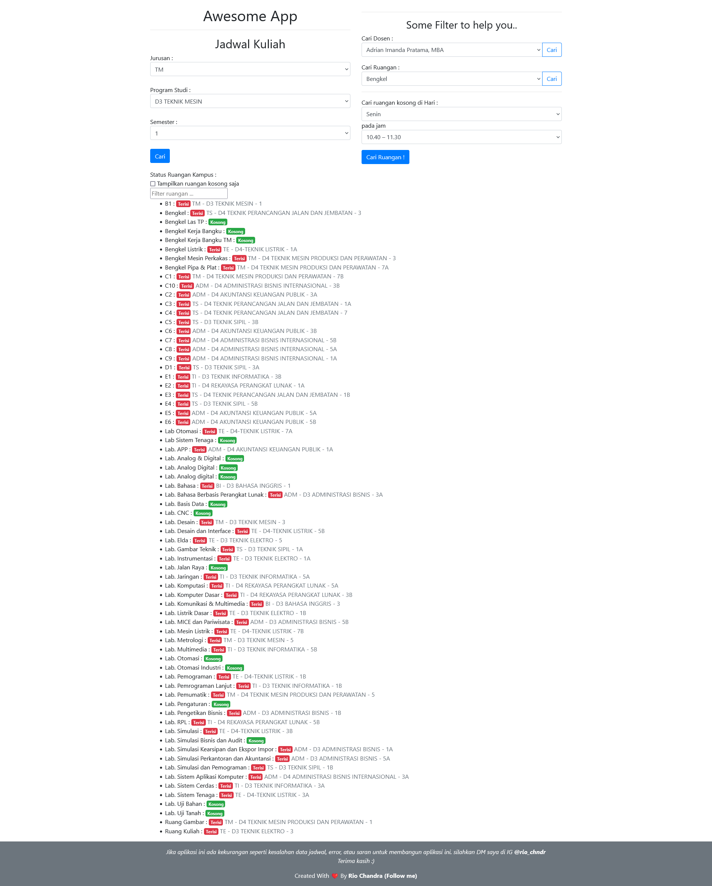

# toolkit-schedule-polbeng

Ini adalah aplikasi simple untuk mempermudah pekerjaan komting/ketua kelas di Politeknik Negeri Bengkalis untuk mencari dosen dan ruangan. sistem yang sudah ada hanya menggunakan file excel yang dikirim dari BAAK, jadi saya berinisiatif untuk membuat aplikasinya.

## Cara Penggunaan 

- Install [vagrant](https://www.vagrantup.com/)
- jalankan perintah `vagrant up`
- buka link `localhost:8080`

## Screenshot

